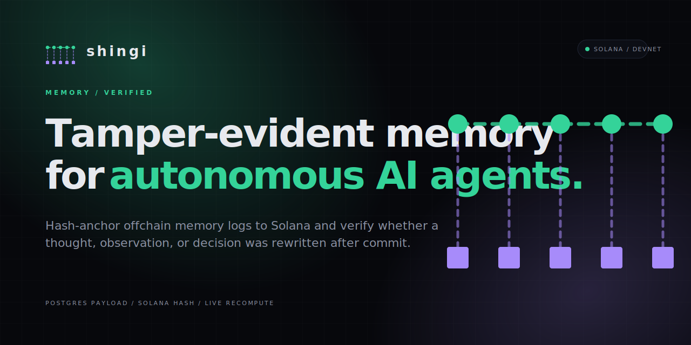

<p align="center">
  
</p>

<h1 align="center">Shingi</h1>

<p align="center">
  <strong>Tamper-evident memory for autonomous AI agents on Solana.</strong><br />
  Hash-anchor offchain memory logs and verify whether they were rewritten after commit.
</p>

<p align="center">
  
  
  
  
  
  
</p>

> Shingi provides cryptographic integrity for agent memory logs.
>
> It does **not** provide truth verification, hallucination detection, or "AI forensics." The trust boundary is operator vs. user, not AI vs. user.

## At a glance

| Layer | What lives there | Why it matters |
|---|---|---|
| Postgres `memory_events` | `payload jsonb`, `solana_tx_sig` | Fast reads, mutable by the operator |
| Solana | One `commit_memory(agent, hash)` tx per event | Public, consensus-stamped integrity anchor |
| Verifier | Live payload recompute + onchain comparison | Detects post-hoc edits to the offchain record |

## How it works

```mermaid
flowchart LR
    A[Agent records memory payload] --> B[Canonicalize JSON<br/>and sha256 hash]
    B --> C[commit_memory(agent, hash)<br/>on Solana]
    B --> D[Store full payload<br/>in Postgres]
    D --> E[Verifier recomputes hash<br/>from live payload]
    C --> E
    E --> F{Hashes match?}
    F -->|Yes| G[Untouched]
    F -->|No| H[Tampered]
```

The hash is **not** stored in Postgres. The verifier always recomputes `sha256(canonicalJson(payload))` from the live row and compares it to the onchain commit. A stored hash would just be another field the operator can edit.

## Demo flow

`Seed memories -> verify untouched -> tamper Postgres payload -> verify mismatch`

1. Visit `/` and, when admin mode is enabled, click **Seed memories (admin)**.
2. The server commits 6 memory events to devnet using the admin keypair.
3. Open any memory from **Recent memories** to load `/verify/[id]`.
4. The page shows **Verified - untouched** when the recomputed hash matches the Solana commit.
5. Click **Tamper this memory** to mutate `payload.confidence` in Postgres.
6. Refresh verification and the page flips to **Tampered - hash mismatch** with the original Solscan link still intact.

## Stack

- Next.js 16 / React 19 / Tailwind v4 (App Router, bun)
- Supabase (Postgres) for live payload storage
- Solana devnet, single-instruction Anchor program ([programs/shingi/](programs/shingi/))
- LiteSVM for in-process program tests

## Getting started

```sh
bun install

# Solana toolchain (one-time)
sh -c "$(curl -sSfL https://release.anza.xyz/stable/install)"
echo 'export PATH="$HOME/.local/share/solana/install/active_release/bin:$PATH"' >> ~/.zshrc
source ~/.zshrc

# Anchor (one-time, cargo only)
cargo install --git https://github.com/coral-xyz/anchor avm --force
avm install 0.31.1 && avm use 0.31.1

# Wallet for deploy (one-time)
solana-keygen new --outfile ~/.config/solana/id.json
solana config set --url devnet
solana airdrop 2   # or use https://faucet.solana.com if rate-limited

# Build & deploy the program
cargo build-sbf --manifest-path programs/shingi/Cargo.toml
cargo test --manifest-path programs/shingi/Cargo.toml   # LiteSVM smoke test
solana program deploy target/deploy/shingi.so \
  --program-id programs/shingi/shingi-keypair.json

# Run the migrations + seed agents
# (in your Supabase dashboard or via supabase CLI)
psql ... -f supabase/migrations/0001_init.sql
psql ... -f supabase/migrations/0002_memory_events.sql
psql ... -f supabase/seed.sql

# Start the app
bun run dev
```

Open <http://localhost:3000>.

## Environment variables

Copy `.env.example` to `.env.local` and fill in.

| Variable | Required | Purpose |
|---|---|---|
| `NEXT_PUBLIC_SUPABASE_URL` | yes | Supabase project URL |
| `NEXT_PUBLIC_SUPABASE_ANON_KEY` | yes | Supabase anon key (read-only RLS) |
| `SUPABASE_SERVICE_ROLE_KEY` | yes | Service role key for server inserts (seed + tamper routes) |
| `SHINGI_ADMIN_KEYPAIR` | yes | JSON array of 64 bytes — the keypair that signs `commit_memory` txs from the admin seed route. Generate with `solana-keygen new -o /tmp/admin.json --no-bip39-passphrase --silent` and paste the file contents. **Fund it on devnet** before seeding. |
| `NEXT_PUBLIC_SHINGI_ADMIN_ENABLED` | no | Set to `"true"` to show the "Seed memories" button on the landing page |
| `NEXT_PUBLIC_SOLANA_RPC_URL` | no | Override RPC endpoint (default: `https://api.devnet.solana.com`). Used by both server and wallet adapter. |
| `SOLANA_RPC_URL` | no | Server-only RPC override (takes precedence over `NEXT_PUBLIC_SOLANA_RPC_URL`). Useful if you have a paid endpoint server-side. |
| `NEXT_PUBLIC_SOLANA_CLUSTER` | no | Used to build Solscan links. Default: `devnet`. Set to `mainnet` for production. |

## Known limitations (acknowledged)

- **Memory-hole attack:** the operator can simply delete a `memory_events` row. Pattern A doesn't fix this; v2 addresses it via mirroring or Merkle batches.
- **Truth:** the system proves the payload hasn't been edited, not that the agent's claim was correct. The agent could have hallucinated and committed a hallucination.
- **Single signer:** all demo memories are signed by the admin keypair. Real deployments would have each agent sign with its own key.

## Tests

```sh
bun run test    # vitest: hash core + program client encode/decode
cargo test --manifest-path programs/shingi/Cargo.toml   # LiteSVM
```

## Out of scope (v2)

- SIWS / wallet-based login session
- Pattern C Merkle batching + indexer
- Real AI agents calling `commitMemory` directly
- Multi-agent dispute UI
- Reputation scoring on top of memory events
